# AI Digital Twin for MALE UAV Aero Piston Engines
## 6-Month Implementation Plan (DRDO) and 3-Day Prototype Plan

Date: 24 Sep 2026. Companion to the design spec (models M1–M9) and the full end-to-end plan (30+ months).

---

## 0. What can and cannot be compressed

**Six months is enough** for a validated, ground-based digital twin and mission advisory system. It would run on real flight and test-bed data, and include a hardware-in-the-loop (HIL) demonstration of the onboard node. It is **not enough** for an airworthiness-certified airborne system, a fleet-wide recorder retrofit, or statistically mature failure prognosis. Those depend on flight hours and certification timelines that no team size can compress.

**Three days is enough** for a working proof-of-concept on synthetic data (plus any sample logs available). It shows the whole loop end to end: detect, diagnose, predict, advise, reflect. It proves the architecture, not the accuracy.

### Scope decisions

| Feature | 6-month plan | 3-day prototype | Reason |
| --- | --- | --- | --- |
| M1 Signal trust | Kept (virtual sensors + fault-shape rules) | Simplified (one virtual-sensor model + residual rule) | Cheap, high false-alarm payoff |
| M2 Physics-hybrid twin | Kept, reduced to ~6 health parameters | Simplified (3–4 parameters, lumped model) | Core of the system |
| M3 IAS combustion analyser | **Feasibility study only** (test bed) | Cut | Needs high-rate crank signal access and test-bed torque reference |
| M4 Cylinder model | Kept as neighbour-regression; GNN deferred | Simplified (per-cylinder deviation from mean) | Same insight, less data needed |
| M5 Risk estimators | 2 of 5 kept: thermal runaway + detonation margin (icing if data exists) | 1 kept (thermal time-to-limit) | Highest consequence, physics-driven |
| M6 Root cause | Kept for top ~10 failure modes | Rule table for ~5 modes | Engineered structure, fast to build |
| M7 Survival prognosis | Kept, simplified (Weibull + censoring + covariates) | Simplified on synthetic fleet | Needs censoring from day one |
| M8 Mission advisor | Pre-flight P_complete, budget check (R1), profile options (R3), engine ranking (R2 simplified) | P_complete + 2 profile options | Directly delivers mission reliability |
| R4 In-flight contingencies | Demonstrated on replayed flights only | Cut | Needs onboard integration and procedure approval |
| R5 Maintenance timing | Simple ranked check list | Cut | Optimiser needs a mature M7 |
| R6 Degraded mode | Cached survival table in HIL demo | Cut | — |
| L1 Per-engine recalibration | Kept | Kept (one function) | Makes the twin per-engine |
| L2 Label grading | Kept, manual form (no language model) | Cut | Form is enough at this scale |
| L3 Active learning | Simple review queue | Cut | — |
| L4 Retraining pipeline | Kept, manual trigger | Cut | — |
| L5 New failure-mode discovery, L6 physics self-correction | **Deferred** | Cut | Need a long fleet history |
| S1 Prediction ledger | Kept | Kept (SQLite) | Backbone of self-reflection |
| S2 Auto-debrief | Kept | Kept (one-page report) | Visible value every sortie |
| S3 Calibration audit | Kept | Simplified (one reliability plot) | — |
| S4 Replay + missed-event postmortem | Kept on available history | Cut | — |
| S5 Blind-spot register, S6 confidence gating | Simplified (out-of-distribution flag) | Cut | — |
| Airborne certification | **Out of scope**; certification roadmap document only | Cut | Authority timelines cannot be compressed |
| Federated learning, multi-engine-type support | Deferred | Cut | Not needed for first fleet |

---

# Part A — 6-Month Implementation Plan (DRDO)

## A1. Objective and success criteria

Deliver, within 26 weeks, a ground-based engine digital twin and mission advisory system for one piston engine type on one MALE UAV fleet, plus an HIL demonstration of the onboard node.

At the end of month 6 the system should meet these targets:

| Criterion | Target at month 6 |
| --- | --- |
| Sensor-vs-engine fault attribution (M1) on seeded and replayed faults | ≥ 90% |
| Seeded slow faults detected via health-parameter drift (M2) | ≥ 80% |
| M6 top-3 diagnosis contains the true cause (seeded + historical events) | ≥ 80% |
| Replay on historical data: fewer false advisories than current threshold alarms | ≥ 40% reduction |
| Replay: at least one historical engine event warned earlier than the legacy system | Demonstrated, with lead time stated |
| Pre-flight P_complete produced for every sortie in the shadow trial | 100% of trial sorties |
| Auto-debrief generated within 1 h of data offload | ≥ 90% of trial sorties |
| HIL: onboard M1, M2 and M4 within compute budget on target-class hardware | Demonstrated |

Targets are provisional and should be re-baselined after the Month 1 data audit.

## A2. Assumptions (must be confirmed in week 1)

1. At least **300–500 flight hours** of historical engine telemetry for the fleet, with maintenance and snag records.
2. Access to an **engine test bed for 2–3 weeks** in months 2–3 for seeded-fault runs.
3. Engine operating limits and available engine performance data from the programme or OEM documentation.
4. A **shadow-trial window** in months 5–6: live sorties whose data is offloaded to the system, with no effect on operations.
5. A core team of **9–10 people** (A6), co-located or on a shared secure network.
6. Early engagement with the airworthiness and quality authorities (for example CEMILAC and DGAQA, as applicable) for the certification roadmap. No certification deliverable is due within 6 months.

If assumption 1 fails (little historical data), shift weight to test-bed and synthetic data. Replay targets then become "demonstrated on test-bed data".

## A3. Month-by-month plan

### Month 1 — Foundations (weeks 1–4)

| Workstream | Tasks | Deliverable |
| --- | --- | --- |
| Programme | Kick-off; confirm engine, fleet and scope; name model owners and safety lead; freeze success criteria | Charter, RACI, criteria v1 |
| Data | Data audit (channels, rates, hours, gaps); ingest pipeline; engine registry keyed by engine serial number | Data audit report; pipeline v0 |
| Reflection | Prediction-ledger schema; switch ledger on for **existing** threshold alarms and snags | Ledger v0 on legacy system |
| Twin | Mean-value physics core v0: manifold, turbo/wastegate, lumped thermal, oil | Physics core v0 |
| Diagnosis | FMEA-to-signature workshop with engine and maintenance experts; pick top ~10 failure modes | Signature matrix v0 |
| Test bed | Seeded-fault test plan, instrumentation list, safety review for the test bed | Test plan approved |

**Gate 1 (end of week 4):** data audit accepted; physics core reproduces healthy runs within ±5%; test bed booked.

### Month 2 — Twin core (weeks 5–8)

| Workstream | Tasks | Deliverable |
| --- | --- | --- |
| M1 | Leave-one-out virtual sensors (gradient-boosted); fault-shape rules (stuck, drift, spike, open circuit); synthetic sensor-fault injection for testing | M1 v1 |
| M2 | Hybrid form: physics core plus small neural residual trained on healthy data; Kalman filter for states; slow estimator for ~6 health parameters (volumetric efficiency, turbo efficiency, wastegate gain, per-cylinder combustion index, head heat transfer, oil circuit resistance) | M2 v1 |
| L1 | Per-engine baseline calibration and change-point detection against maintenance records | Recalibration job |
| Test bed | Seeded-fault campaign part 1: plugs, ignition channel, induction leak, wastegate friction, sensor bias | Labelled test-bed dataset part 1 |

**Gate 2 (end of week 8):** physics core within ±3% on healthy runs; M1 ≥ 85% attribution on injected sensor faults; M2 parameters move in the right direction for part-1 seeded faults.

### Month 3 — Detection and diagnosis (weeks 9–13)

| Workstream | Tasks | Deliverable |
| --- | --- | --- |
| M4 | Per-cylinder expected EGT/CHT from neighbours and operating point; deviation trend | M4 v1 |
| M5 | Thermal time-to-limit (forward simulation using M2); detonation margin estimator; icing estimator if humidity/airbox data exists | M5 v1 (2–3 estimators) |
| M6 | Bayesian network over the top ~10 failure modes, M1 states and M2/M4/M5 evidence; first recommended check per cause | M6 v1 |
| M3 | Feasibility study: can the crank pickup be sampled at high rate on the test bed? Record a dataset if so | Feasibility note (+ dataset) |
| Test bed | Seeded-fault campaign part 2: coolant restriction, oil filter restriction, mixture imbalance, controlled valve leak | Labelled dataset part 2 |
| L2 | Maintenance finding form with evidence grades A/B/C | Label form in use |

**Gate 3 (end of week 13, mid-programme review):** M6 top-3 contains the true cause in ≥ 75% of seeded faults; mid-term demonstration to programme leadership.

### Month 4 — Prognosis and mission advisory (weeks 14–17)

| Workstream | Tasks | Deliverable |
| --- | --- | --- |
| M7 | Weibull survival with right-censoring; covariates from health-parameter trends; tail-level random effect; per failure family where data allows, otherwise one family | M7 v1 |
| M8 | Pre-flight P_complete for a planned profile; reliability budget check (R1); 2–3 profile options trading time on station for P_complete (R3); fleet engine ranking for mission assignment (R2 simplified) | M8 v1 |
| Reflection | Auto-debrief report (S2); calibration audit (S3); out-of-distribution flag (S6-lite) | Debrief v1, calibration panel |
| Ground UI | Mission-planner view (go / conditional go / no-go with drivers); maintainer view (diagnosis + first check); fleet view | Ground console v1 |

**Gate 4 (end of week 17):** full chain working on replayed sorties, from raw data through M1–M8 to debrief. Calibration of M7 checked on held-out engines (expect wide bands; this is acceptable at this stage).

### Month 5 — Integration, replay validation and HIL (weeks 18–22)

| Workstream | Tasks | Deliverable |
| --- | --- | --- |
| Replay (S4) | Run the full system over all historical data; compare against legacy alarms on false advisories and lead time; missed-event postmortem for each historical engine event | Replay validation report |
| Retraining (L4) | Retraining pipeline with a replay set of seeded faults; versioned, signed models; release classes A/B/C | Pipeline + first versioned release |
| HIL | Port M1, M2, M4 (and M5 thermal) to a rugged embedded board; quantise; feed recorded flights at real time through a CAN/serial simulator; compact health packet over a simulated low-rate link; cached survival table (R6-lite) | HIL demo rig |
| Robustness | Stress tests: missing channels, link dropouts, noisy data, out-of-range conditions | Robustness report |
| Operations | Train pilots, planners and maintainers on the console for the shadow trial | Training delivered |

**Gate 5 (end of week 22):** replay shows ≥ 40% fewer false advisories than legacy, or the gap is explained; HIL meets the compute budget; Model Review Board approves the shadow trial.

### Month 6 — Shadow trial, evaluation and handover (weeks 23–26)

| Workstream | Tasks | Deliverable |
| --- | --- | --- |
| Shadow trial | Run the system on every live sortie's offloaded data. Pre-flight advisories are recorded but not acted on; debriefs are produced after landing | Trial log, ledger entries |
| Reflection | Resolve ledger entries; calibration and false-advisory statistics; operator and maintainer feedback | Trial evaluation report |
| Certification | Certification roadmap for the airborne advisory node, prepared with the airworthiness authority | Certification roadmap |
| Handover | Documentation, source code, models, datasets, test reports; phase-2 proposal (airborne integration, M3, L5/L6) | Final report and demo |

**Final gate (week 26):** success criteria in A1 assessed; go/no-go decision for phase 2 (airborne integration).

## A4. Gantt view

```mermaid
gantt
  title 6-month plan (weeks)
  dateFormat  X
  axisFormat %s
  section Foundations
  Data audit + pipeline        :0, 4
  Ledger on legacy alarms      :2, 4
  Physics core                 :1, 8
  section Twin and diagnosis
  M1 signal trust              :4, 8
  M2 hybrid twin + L1          :5, 13
  Seeded-fault test bed        :6, 13
  M4 + M5 + M6                 :8, 17
  section Mission reliability
  M7 survival                  :13, 17
  M8 advisor + console         :13, 18
  section Reflection and learning
  Debrief + calibration        :13, 18
  Replay validation            :17, 22
  Retraining pipeline          :17, 22
  section Edge and trial
  HIL rig                      :17, 22
  Shadow trial                 :22, 26
  Evaluation + handover        :24, 26
```

## A5. Deliverables at month 6

1. Ground digital-twin software: M1, M2, M4, M5 (2–3 estimators), M6, M7, M8.
2. Prediction ledger, auto-debrief, calibration audit, replay harness.
3. Ground console with mission-planner, maintainer and fleet views.
4. Retraining pipeline with versioned, signed models and release classes.
5. HIL demonstration rig of the onboard node.
6. Labelled seeded-fault dataset from the test bed.
7. Reports: data audit, replay validation, robustness, shadow-trial evaluation, M3 feasibility.
8. Certification roadmap and a phase-2 proposal.

## A6. Team (9–10 people)

| Role | Count | Main work |
| --- | --- | --- |
| Programme / technical lead | 1 | Scope, gates, stakeholders |
| Engine and test-bed engineer | 1 | Physics core, seeded faults, FMEA |
| Physics-ML engineer | 2 | M2 hybrid twin, M5, L1 |
| ML engineer | 2 | M1, M4, M6, M7, M8 |
| Data / platform engineer | 1 | Pipeline, stores, ledger, console backend |
| Embedded engineer | 1 | HIL rig, quantisation, onboard software |
| Reliability and safety engineer | 1 | M7/M8 validity, guardrails, certification roadmap |
| Maintainer and operator representatives | part-time | Labels, usability, shadow trial |

## A7. Technology stack (suggested)

Python; NumPy/SciPy; JAX + Diffrax or PyTorch for the hybrid ODE; FilterPy or a custom EKF/UKF; LightGBM for virtual sensors; pgmpy for the Bayesian network; lifelines or PyMC for survival; PostgreSQL + TimescaleDB; MLflow; Dagster or Airflow; a web console (FastAPI + a React or Streamlit front end); ONNX Runtime on the embedded board. Deploy on-premises on a secure network; choose tools against the programme's security requirements.

## A8. Key risks for the 6-month timeline

| Risk | Impact | Mitigation |
| --- | --- | --- |
| Historical data sparse or low-rate | Weak replay validation and M7 | Lean on test-bed and synthetic data; state results as "test-bed validated" |
| Test-bed slot slips | Seeded-fault labels late; M6 poorly tuned | Book in week 1; keep a physics-synthetic fallback |
| Engine performance maps unavailable | Physics core less accurate | System identification on test-bed runs; neural residual absorbs the rest |
| Too few historical failures | M7 survival bands very wide | Report honestly with uncertainty; M8 uses conservative bounds |
| Shadow-trial window lost | No live evaluation | Extend replay validation; schedule trial as phase-2 start |
| Scope creep toward airborne certification | Timeline breaks | Certification is a roadmap document only in this phase |

---

# Part B — 3-Day Prototype Plan

## B1. Goal

In 3 working days, build a runnable proof-of-concept that demonstrates the full loop on synthetic engine data. The loop runs from telemetry through sensor trust, health estimation, diagnosis and survival prediction to a mission go/no-go decision and a self-reflection debrief. If real sample logs are available, run them through the same pipeline as a bonus.

What the prototype proves: the architecture works end to end, and the physics-hybrid idea separates sensor faults from engine faults. What it does not prove: accuracy on real engines.

## B2. Team and setup

- **Team:** 3 engineers. A: physics and simulation. B: ML models. C: data, ledger and dashboard.
- **Stack:** Python, NumPy/SciPy, scikit-learn or LightGBM, FilterPy, lifelines, SQLite, Streamlit + Plotly.
- **Repo layout:** `sim/`, `models/`, `advisor/`, `ledger/`, `app/`, `data/`.

## B3. Day 1 — Synthetic engine and data backbone

| Time | Engineer A (physics) | Engineer B (ML) | Engineer C (data/app) |
| --- | --- | --- | --- |
| Morning | Lumped engine simulator: RPM, MAP, fuel flow → per-cylinder EGT/CHT, oil T/P, coolant T, boost. Parameters for 4 health factors: volumetric efficiency, turbo efficiency, per-cylinder combustion index, oil circuit resistance | Define fault library: 5 engine faults (weak cylinder, turbo degradation, induction leak, coolant restriction, oil restriction) and 4 sensor faults (bias, drift, stuck, dropout) | Data schema, SQLite tables (flights, telemetry, predictions, outcomes), prediction-ledger API |
| Afternoon | Mission profiles (climb, cruise, loiter, descent) with altitude and OAT; noise model | Generate synthetic fleet: 20 engines × 30–60 sorties each; slow wear, random faults, some failures, most censored (removed at time-between-overhaul or still flying) | Ingest synthetic data into SQLite; skeleton Streamlit app with a flight picker and telemetry plots |

**End of day 1:** a synthetic fleet dataset exists with ground-truth labels, and the app can browse flights.

## B4. Day 2 — Twin, trust, diagnosis, prognosis

| Time | Engineer A | Engineer B | Engineer C |
| --- | --- | --- | --- |
| Morning | M2-lite: estimate the 4 health factors per flight by fitting the simulator to steady segments (least squares or EKF); L1 per-engine baseline and trend | M1-lite: virtual sensor for one EGT and the oil temperature (LightGBM on the other channels); residual rule to call a sensor fault vs an engine event | Write M1 and M2 outputs to the ledger; health-factor trend plots per engine |
| Afternoon | M5-lite: thermal time-to-limit by forward-simulating the M2 model at the current power setting | M4-lite: per-cylinder deviation from the mean of the others. M6-lite: rule table mapping evidence patterns to the 5 faults, top-3 with scores and a first check. M7-lite: Weibull with censoring (lifelines) using the health-factor trend as a covariate | Diagnosis panel: top-3 causes, evidence, first check |

**End of day 2:** for any flight, the app shows trusted channels, health-factor drift, cylinder deviations, a ranked diagnosis and each engine's survival curve.

## B5. Day 3 — Mission advisory, reflection, demo

| Time | Engineer A | Engineer B | Engineer C |
| --- | --- | --- | --- |
| Morning | M8-lite: stress multiplier from power and CHT; P_complete for a planned profile; 2 alternative profiles (lower power cap, lower altitude) with the time-on-station cost | Fleet ranking: best engines for a long mission (R2-lite); reliability budget check (R1) giving go / conditional go / no-go | Mission-planner page: enter a profile, see P_complete, verdict, options and drivers |
| Afternoon (to 15:00) | Validation: detection and attribution on the synthetic test set | Self-reflection: resolve ledger entries against synthetic outcomes; reliability plot of predicted vs realised completion; auto-debrief page per flight | Polish UI; one-page README; demo script |
| 15:00–17:00 | **Rehearse and deliver demo (all)** | | |

### Demo script (15 minutes)

1. **Sensor lies:** a flight with a drifting EGT thermocouple. M1 flags the sensor, and no engine alarm is raised.
2. **Engine wears:** an engine whose turbo efficiency is slowly declining. M2 shows the drift weeks before any limit is reached; M6 ranks turbo degradation first and gives the first check.
3. **Cylinder distress:** cylinder 3 separating from its neighbours (M4) while still inside limits.
4. **Mission decision:** plan a 24 h sortie on that engine and get a conditional go. A lower power cap raises P_complete at a stated time-on-station cost. The fleet ranking suggests a healthier engine instead.
5. **Self-reflection:** the ledger shows predicted vs realised outcomes across the synthetic fleet, plus an auto-debrief for one flight.

### Prototype success criteria

| Check | Target |
| --- | --- |
| Full loop runs from raw data to debrief with one command | Yes |
| Sensor-vs-engine attribution on the synthetic test set | ≥ 85% |
| Injected slow faults visible as health-factor drift before the limit | ≥ 4 of 5 fault types |
| M6 top-3 contains the injected cause | ≥ 80% |
| P_complete, verdict and 2 options produced for any planned profile | Yes |
| Ledger reliability plot and per-flight debrief generated | Yes |

### Cut from the prototype (stated in the demo)

IAS combustion analysis, graph neural network, detonation and icing models, Bayesian network (a rule table is used instead), retraining pipeline, label grading, replay harness, HIL/edge deployment, in-flight contingencies, and any claim of real-engine accuracy.

---

## C. How the three plans connect

| Horizon | Plan | Proves |
| --- | --- | --- |
| 3 days | Prototype on synthetic data | Architecture and the full loop work |
| 6 months | Ground twin + HIL + shadow trial on real data | Value on real engines, and the case for airborne integration |
| 30+ months | Full end-to-end plan | Certified airborne advisory, self-learning at fleet scale, measured mission-reliability gains |

The prototype code becomes the skeleton of the 6-month build. The 6-month outputs (data, ledger, validated models, certification roadmap) become Phase 0–2 of the long plan.
